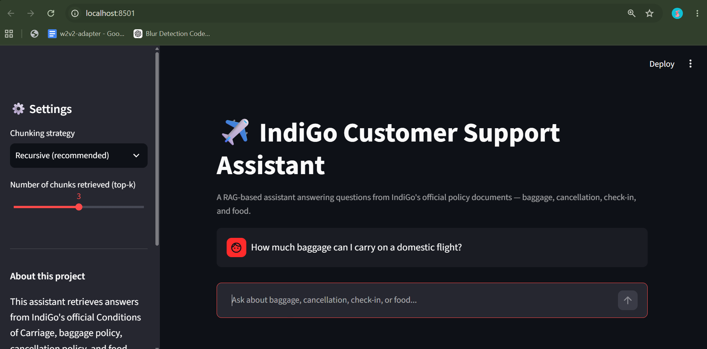

# ✈️ IndiGo Customer Support RAG Assistant

A Retrieval-Augmented Generation (RAG) system that answers customer queries about IndiGo airline policies — baggage, cancellation/refunds, check-in, and food — using semantic search over official policy documents, with grounded, citation-backed responses and hallucination prevention.


##  Motivation

Airline customer support chatbots need very high factual accuracy — an incorrectly stated baggage or cancellation policy can be costly (e.g., the 2024 Air Canada case where a chatbot's incorrect refund policy statement was legally binding on the airline). This project builds a domain-specific RAG pipeline with a strong grounding guardrail: the system explicitly says "I don't know" rather than fabricating an answer, and every response cites its source document.

There is no existing public benchmark for airline-domain QA, so this project also includes a **custom evaluation framework** to measure retrieval quality.

##  Architecture

User Query → Embedding → Vector Search (ChromaDB) → Top-K Chunks → LLM (grounded generation) → Answer + Citation

- **Knowledge base**: IndiGo's official Conditions of Carriage, baggage policy, cancellation policy (Plan B), check-in policy, and food menu — manually collected and structured from IndiGo's official website.
- **Chunking**: 3 strategies implemented and compared — fixed-size, recursive (paragraph-aware), and section-aware (custom, exploits the natural header structure of policy documents).
- **Embeddings**: `sentence-transformers/all-MiniLM-L6-v2`.
- **Vector DB**: ChromaDB (persistent, local).
- **Generation**: Groq (Llama 3.3 70B), with a strict grounding prompt to prevent hallucination.
- **Evaluation**: Custom 10-question benchmark with Precision@K, Recall@K, and MRR, comparing all 3 chunking strategies.
- **UI**: Streamlit chat interface with live strategy switching.

## 📊 Evaluation Results

| Strategy | Precision@3 | Recall@3 | MRR |
|----------|------------|----------|-----|
| Fixed-size | 0.900 | 1.000 | 1.000 |
| Recursive | **0.933** | 1.000 | 0.950 |
| Section-aware | 0.900 | 1.000 | 0.950 |

Recursive chunking gave the best precision, while fixed-size chunking most consistently ranked the correct source first. This highlights that "best" chunking strategy is metric-dependent, not universal — a key finding validated empirically rather than assumed.

##  Running Locally

```bash
git clone <repo-url>
cd airline-rag-assistant
python -m venv venv
source venv/bin/activate  # or venv\Scripts\activate on Windows
pip install -r requirements.txt

# Add your GROQ_API_KEY to a .env file
echo "GROQ_API_KEY=your_key_here" > .env

# Index the knowledge base
python src/index_all.py

# Run evaluation (optional)
python src/evaluate.py

# Launch the UI
streamlit run app.py
```

##  Project Structure

airline-rag-assistant/
├── data/                       # Policy documents + eval questions
├── src/
│   ├── chunking.py             # 3 chunking strategies
│   ├── embeddings.py           # Embedding model wrapper
│   ├── vectorstore.py          # ChromaDB indexing + retrieval
│   ├── generation.py           # LLM generation with grounding guardrail
│   ├── evaluate.py             # Retrieval evaluation framework
│   └── index_all.py            # Indexes all 3 chunking strategies
├── app.py                      # Streamlit UI
└── requirements.txt

## ⚠️ Limitations

- Knowledge base is scoped to 4 policy documents (baggage, cancellation, check-in, food) collected from IndiGo's public website — not the full Conditions of Carriage.
- Evaluation set is a small (10-question) custom benchmark; results are directionally informative rather than statistically exhaustive given the small corpus size.
- No live flight data integration — this is a policy/FAQ assistant, not a booking or live-status system (an explicit design choice to keep the scope focused on core RAG mechanics).

##  Future Improvements

- Expand knowledge base coverage (special assistance, liability, denied boarding).
- Add reranking step for improved precision.
- Compare additional embedding models (e.g., multilingual-e5).
- Add hallucination-rate as an explicit evaluation metric using an LLM-as-judge approach.
